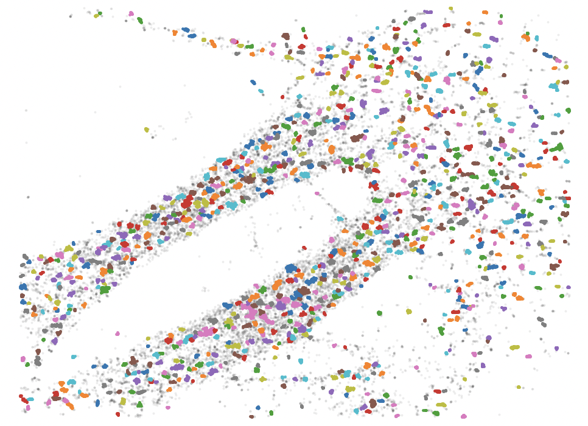

# STORM Analysis

The best way to run the analysis is on your local machine. On Mac:
- First time only:
	- Make sure python is installed by typing `python` or `python3` in terminal.
	- Install necessary packages:
		- `pip install numpy`
		- `pip install pandas`
		- `pip install matplotlib`
		- `pip install scikit-learn`
		- `pip install scipy`
		- `pip install tqdm`
	- Navigate to the folder you would like to run the analysis from using the `cd` command (e.g. `cd Desktop`)
	- Clone the repository: `git clone https://github.com/cmackenzie29/storm.git`
- To run the analysis:
	- Navigate to the `storm` folder (e.g. `cd storm`, `cd Desktop/storm`, etc.)
	- Run the program by typing `python storm.py` or `python3 storm.py`

Alternatively, you can run the analysis from Google Colab with your STORM files stored in Google Drive.

## Analysis Modes
- **Basic**: Analyze all molecules in the image, without clustering
- **Clusters with all molecules together**: Analyze only the molecules in the image which are in clusters, where each cluster includes all specified colors
- **Clusters with only one color**: Analyze only the molecules in the image which are in clusters, where each cluster includes just one color

## Outputs
- **nndists** (basic and clusters): Average distance from molecules of one color to each nearest molecule of another color, for every possible combination of colors
- **synapses** (clusters):
	- Average molecule count per synapse for each color
	- Average molecule density per synapse for each color
	- Average synapse volume for each color
	- Average molecule intensity per synapse for each color
- **png files** (clusters) showing the identified clusters for each image given the chosen DBSCAN parameters

Note: distance units are μm

